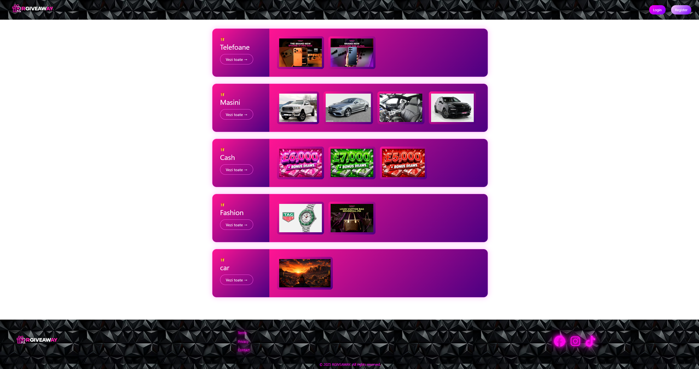
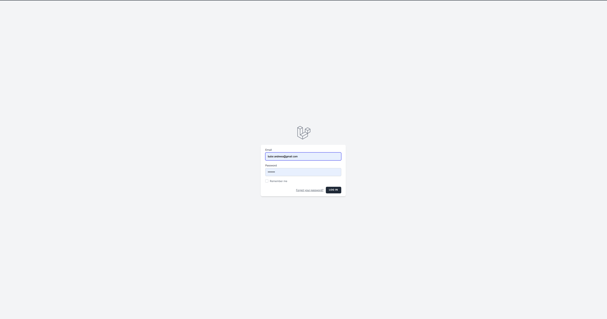
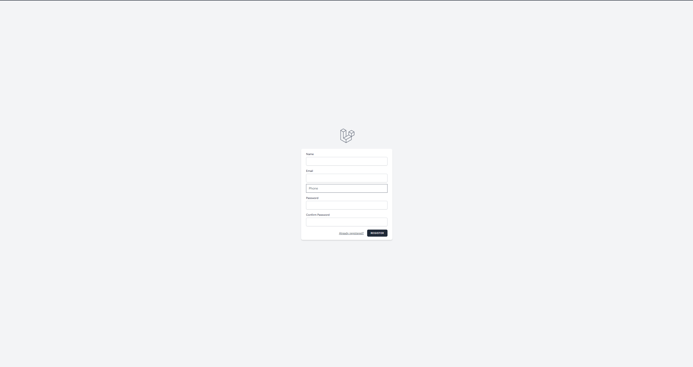
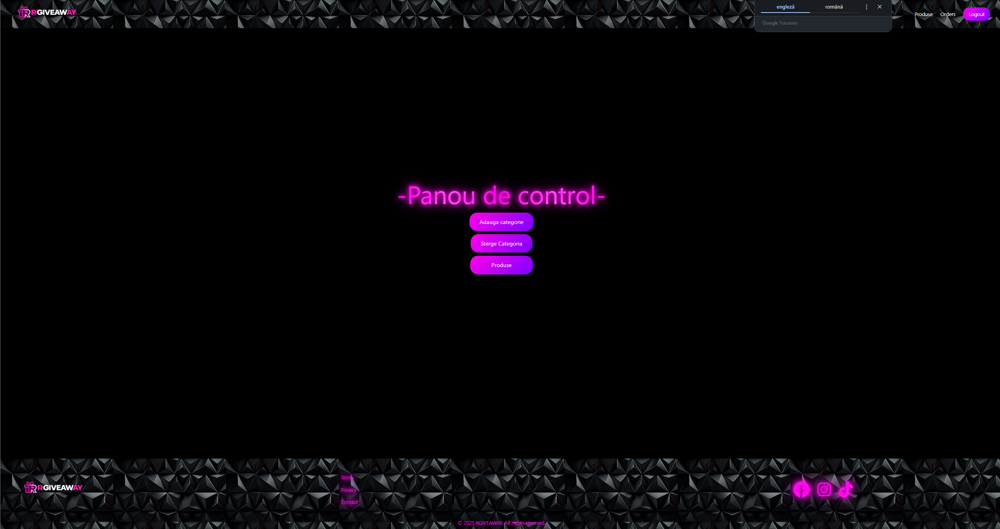
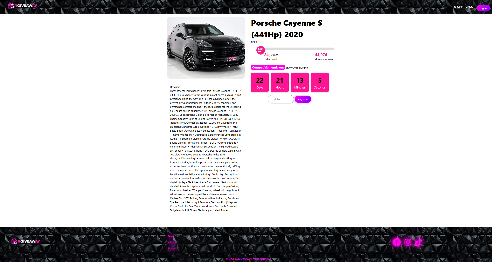
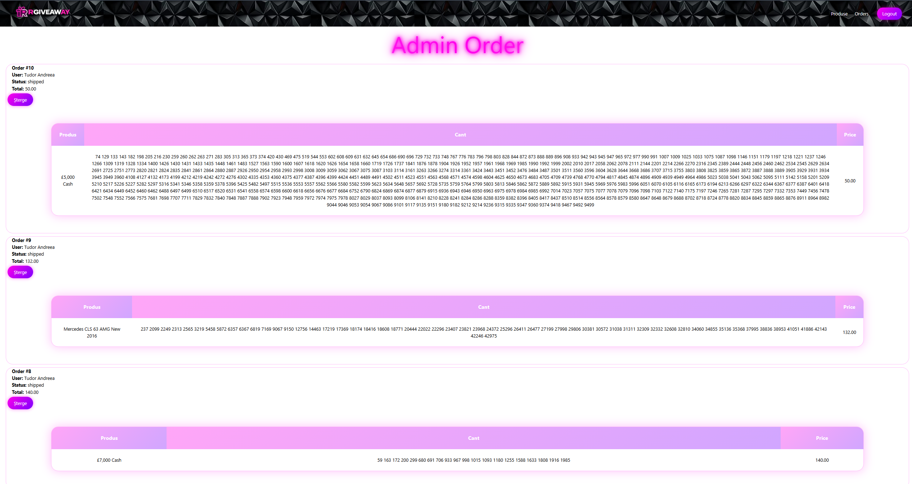
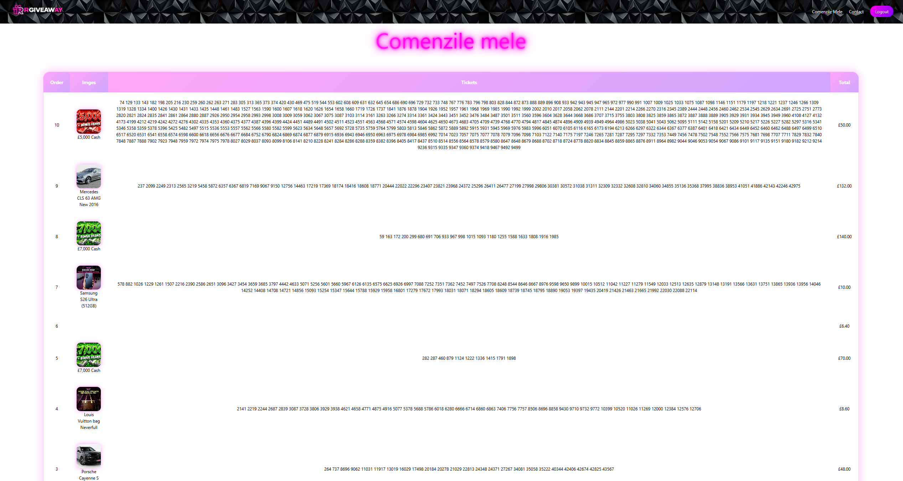

# Giveaway Platform

## Description

Giveaway Platform is a web application developed with Laravel, designed to manage and organize online giveaways. It includes a complete administration panel, user authentication, product and category management, an order system, and a ticket-based giveaway mechanism.

## Technologies Used

- PHP 8
- Laravel
- MySQL
- HTML5
- CSS3
- JavaScript
- Bootstrap
- Git

## Features

- User Authentication
- User Registration
- Admin Dashboard
- Product CRUD
- Category CRUD
- Order Management
- Image Upload
- Ticket System
- Responsive Design

## Screenshots

## Home Page


## Login


## Register


## Control Panel



## Products



## Admin Orders



## User Orders



## Installation

```bash
git clone https://github.com/ClaudiuDaniel2001/Giveaway-page.git

cd Giveaway-page

composer install

npm install

cp .env.example .env

php artisan key:generate

php artisan migrate

php artisan storage:link

npm run dev

php artisan serve
```

## Author

Claudiu Alexandroae
Junior Full Stack Web Developer
